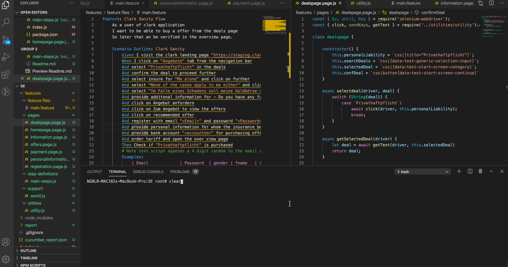

# Clark Sanity Test Automation

This test automation project is created with Node.js, Selenium-webdriver, Cucumber, chai and chai-as-promised.

## Setting up the local test environment

<u>Note : Node.js and npm needs to installed in the PC.</u> 

1. Clone the project from git https://github.com/Bharath-Kumar-S/Clark_QA_Challenge.git
2. cd to the cloned folder and run `npm install` from the command prompt. This downloads all required library from npmjs.org 
3. Execute the tests by running `npm run test` in the command prompt
4. HTML report is generated after the test execution with the timestamp in the file name.

### Utilities 

`const { click, sendKeys, getText } = require('../utilities/utility').webelement_actions;`

1. construct locator 

`const construct_locator = async (driver, locator) => {
    let loc = locator.split('|');
    await driver.wait(until.elementLocated(By[loc[0]](loc[1])));
    return await driver.findElement(By[loc[0]](loc[1]));
}`

the above method in utilities is used the locator from  `css|button[data-test-start-screen-continue]` to `driver.findElement(By.css("button[data-test-start-screen-continue]"))`.

2. Click - click method used along the framework. Checks and waits for element located and displayed before performing click.  
3. sendKeys - sendKeys method used along the framework. Checks and waits for element located and enabled before performing sendKeys.  
4. getText - Used to get text from webelement. Checks and waits for element to be located

### Scenario Outline

Used to run the same feature with different data in the examples

 Examples:
            | Email             | Password  |
            | bharath@gmail.com | Test@1234 |

### World object.

`support/world.js` is the file which cucumber takes all its hooks. Webdriver object is created here.

### HTML report 

HTML reports are in `report` folder with the timestamp in the file name.

### Improvements

1. More resuable functions needs to be written
2. More assertions to be included 
2. Include screenshots in report
3. Visual regression testing to be included
4. Loctor fallback strategy to be included
5. Generic test data from a JSON file.
6. Support for API validation and Database validation.

Above improvements I have implemented in protractor, playwright, webdriver.io. Repository can be found at https://github.com/Bharath-Kumar-S

Find my stackoverflow contributions at https://stackoverflow.com/users/8903949/bharath-kumar-s

Linkedin Profile : https://www.linkedin.com/in/bharath-kumar-s-a4339aa7/

